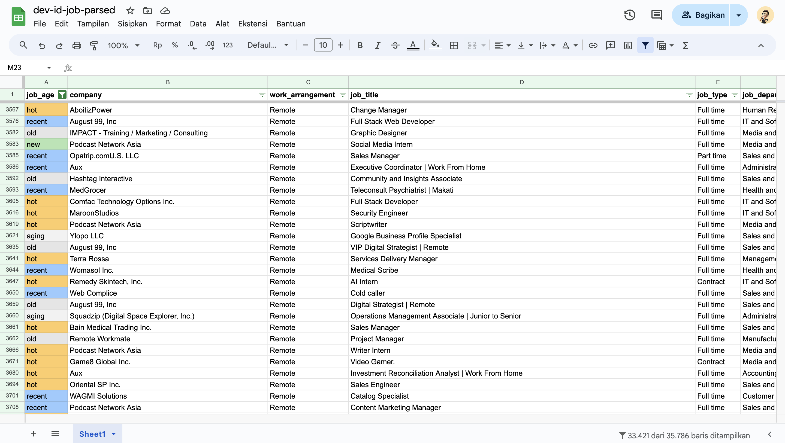

# id-jobs: Your Ultimate Explosion of Indonesian Job Market Data! 💥🧙‍♀️

## 🎆 What's New in Our Latest Explosion? 🎆

- **Flip Jobs Integration**: Unleashed the power to scrape job listings from Flip's career portal!
- **Karir.com API Mastery**: Harnessed the arcane energies of Karir.com's API for maximum job data extraction!
- **Explosive Pagination**: Implemented a pagination system that blasts through ALL available job opportunities!
- **Work Arrangement Tracking**: Identify Remote, Hybrid, and On-site opportunities with pinpoint accuracy!
- **Job Apply End Date Calculation**: Automatically determine application deadlines with magical precision!
- **Enhanced Data Sanitization**: Improved our pre-upload cleansing rituals for purer, more potent data!
- **Job Age Tracking**: Monitor the age of job listings to pinpoint the freshest opportunities!

## 🌋 Overview

id-jobs harnesses the explosive power of web scraping to gather job listings from a vast array of Indonesian job portals and company websites, always respecting each site's terms of service. It's like casting a wide-area Explosion spell on the job market!

📊 **Witness the Explosion of Job Data:** [https://s.id/id-jobs-v2](https://s.id/id-jobs-v2)

🇮🇩 **Note:** id-jobs is specifically enchanted for the Indonesian job market.

## 🔥 Job Age Color Codex

Quickly identify the freshness of job listings with our color-coded system, inspired by the varying intensities of magical explosions:

| Job Age Category | Time Range | Color | Description |
|------------------|------------|-------|-------------|
| New | <= 1 day |  Bright Light Green | Fresh as a newly cast spell! |
| Hot | 1 to 7 days |  Warm Light Orange | Still sizzling with opportunity! |
| Recent | 8 to 15 days |  Light Blue | The magic lingers... |
| Aging | 16 to 21 days |  Very Light Gray | The spell's power wanes... |
| Old | 22 to 30 days |  Light Gray | Ancient arcana, approach with caution. |
| Expired | > 30 days |  Medium Gray | The magic has dissipated. |

## 💥 How It Works

id-jobs automatically casts its net wide, visiting Indonesian job websites with the precision of a perfectly aimed Explosion spell. It collects relevant information and organizes it into a single, powerful spreadsheet. The data undergoes rigorous magical cleansing and formatting before being uploaded, ensuring consistency and readability worthy of the finest spell books.

## 🔮 Preview

Behold, a glimpse into the arcane power of id-jobs data:

## 🚀 Why Harness the Power of id-jobs?

Navigating the labyrinth of job opportunities in Indonesia can be as challenging as mastering Explosion magic. id-jobs simplifies this quest by consolidating information from multiple realms (websites) into one central grimoire (spreadsheet), providing additional insights such as work arrangements and application deadlines that even Megumin would approve of!

## 📚 Tomes of Knowledge (Data Sources)

We gather our arcane knowledge from a wide range of sources, each represented by a powerful spider in our magical arsenal:

- Blibli 🛒
- Dealls 🤝
- Evermos 🌟
- Flip 💳 (New!)
- GoTo 🚗
- Jobstreet 💼
- Kalibrr 🎓
- Karir.com 🌐 (New!)
- SoftwareOne 💻
- Tiket ✈️
- Various company career portals 🏢

Each of these sources is a realm of opportunity, waiting to be explored by our job-seeking wizards. Our spiders weave through these portals, extracting valuable job data with the precision and power of a well-cast Explosion spell!

🔮 Note: Our collection of magical spiders is ever-growing, as we continuously enhance our ability to scry the Indonesian job market. Keep an eye out for new additions to our arcane arsenal!

## ✨ Magical Features

- **Daily Explosions of Updates**: Automated daily updates through CI/CD pipelines that would make any archmage jealous.
- **Work Arrangement Scrying**: Identify Remote, Hybrid, and On-site opportunities with crystal-clear clarity.
- **Application Deadline Divination**: Calculated end dates for job applications, because timing is everything in both magic and job hunting.
- **Optimized Data Collection Rituals**: Improved accuracy and coverage of job listings, leaving no stone unturned.
- **User-Friendly Spell Interface**: Access job data through a Google Sheets interface so intuitive, even a novice wizard could use it.
- **Comprehensive Information Gathering**: Data from multiple job boards and company websites, all in one place.
- **Job Age Tracking**: Identify the freshest job listings with the precision of a finely tuned magical sensor.

## 🧙‍♀️ Getting Started on Your Magical Journey

For a quick guide on how to harness the power of id-jobs, consult our [Quickstart Grimoire](QUICKSTART.md).

## 🔍 Frequently Asked Arcane Questions

Have questions about our magical processes? Check out our [FAQ Scroll](FAQ.md) for answers to common queries from fellow wizards and job seekers.

## 📜 Legal Incantations

id-jobs is open source under the GPL-3.0 license. You're free to use, modify, and share the code, as long as you keep it open source too. Think of it as sharing the secrets of Explosion magic with the world!

We always respect website terms of service when collecting data, because even the most powerful wizards need to follow the rules of the realms they visit.

Now go forth and explode your job search with the power of id-jobs! 💥🎆

---

Note: I let "Megumin AI" write this readme.

