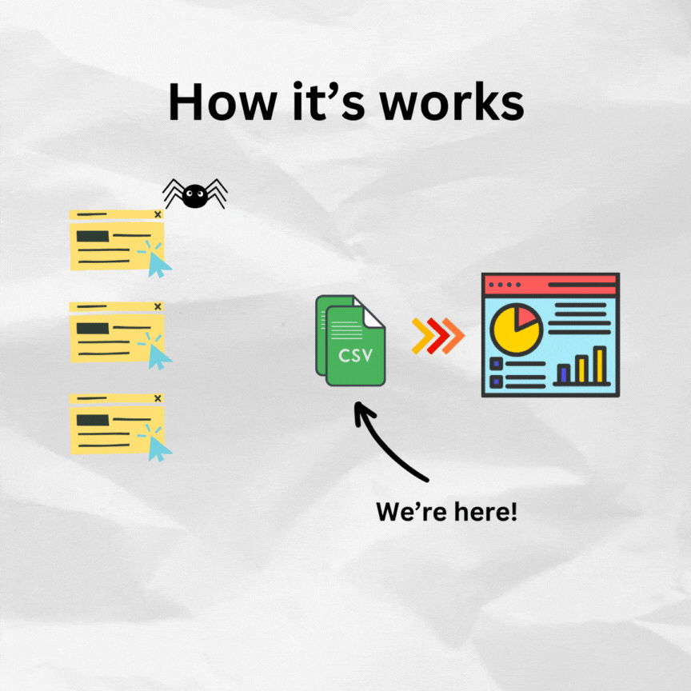

# id-jobs: Your One-Stop Shop for Indonesian Job Market Data

## What is id-jobs?

id-jobs is a tool that gathers job listings from various Indonesian job boards and company websites, organizing them into one easy-to-access Google Sheet.

📊 **View Job Data:** [https://s.id/id-jobs-v2](https://s.id/id-jobs-v2)

🇮🇩 **Note:** id-jobs is specifically designed for the Indonesian job market.

## How Does it Work?

id-jobs automatically visits Indonesian job websites, collects relevant information, and organizes it all in one spreadsheet. This process is done respectfully and in line with each website's terms of service.

## Why Use id-jobs?

Finding the right job in Indonesia can be challenging, with information scattered across multiple websites. id-jobs simplifies this process by bringing all this information together in one place, making it easier for you to find opportunities.

## Where Does the Data Come From?

We collect data from popular Indonesian job sites like Jobstreet, Glints, Kalibrr, TopKarir, Indeed, and various company career pages.

## What Can You Do With This Data?

With all Indonesian job data in one place, you can:
- Spot trends in job titles, salaries, or locations across Indonesia
- Create visual charts and graphs
- Use spreadsheet functions to analyze the Indonesian job market

## Features

- Daily updates of job data
- Easy-to-use Google Sheets interface
- Information from multiple job boards and company websites

## Getting Started

For a quick guide on how to use id-jobs, please refer to our [Quickstart Guide](QUICKSTART.md).

## Frequently Asked Questions

Have questions about id-jobs? Check out our [FAQ](FAQ.md) for answers to common queries.

## Legal Information

id-jobs is open source under the GPL-3.0 license. You're free to use, modify, and share the code, as long as you keep it open source too.

Remember: We always respect website terms of service when collecting data.
